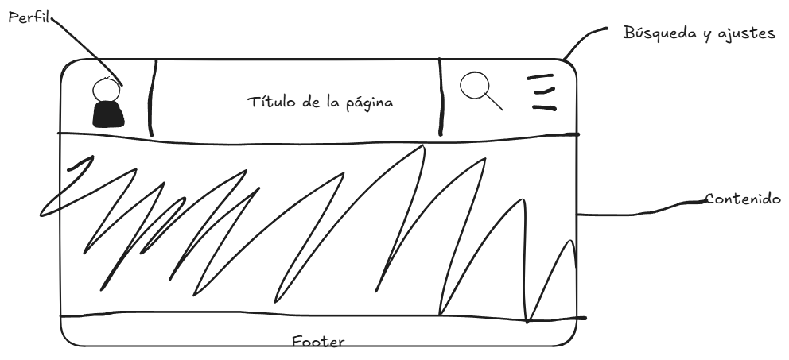

# SkillForge

## Descripción

SkillForge es una plataforma web diseñada para que estudiantes puedan aprender programación mediante ejercicios prácticos, retos y seguimiento de progreso.

---

## Misión (Backend)

La aplicación necesitaría varias entidades principales para poder funcionar correctamente.

| Entidad   | Descripción |
|-----------|-------------|
| Usuarios  | Personas registradas en la plataforma que pueden acceder al contenido. |
| Cursos    | Contenido educativo organizado por niveles y temas. |
| Progreso  | Registro del avance de cada usuario dentro de los cursos. |

### Funcionalidades principales

1. Registro e inicio de sesión de usuarios.
2. Acceso a cursos de programación organizados por niveles.
3. Seguimiento del progreso del estudiante en cada curso.

---

## Misión (Frontend)

El diseño visual de la web se ha creado usando **Excalidraw / Figma** para representar cómo se vería la plataforma desde un navegador de ordenador.

### Prototipo de la interfaz

